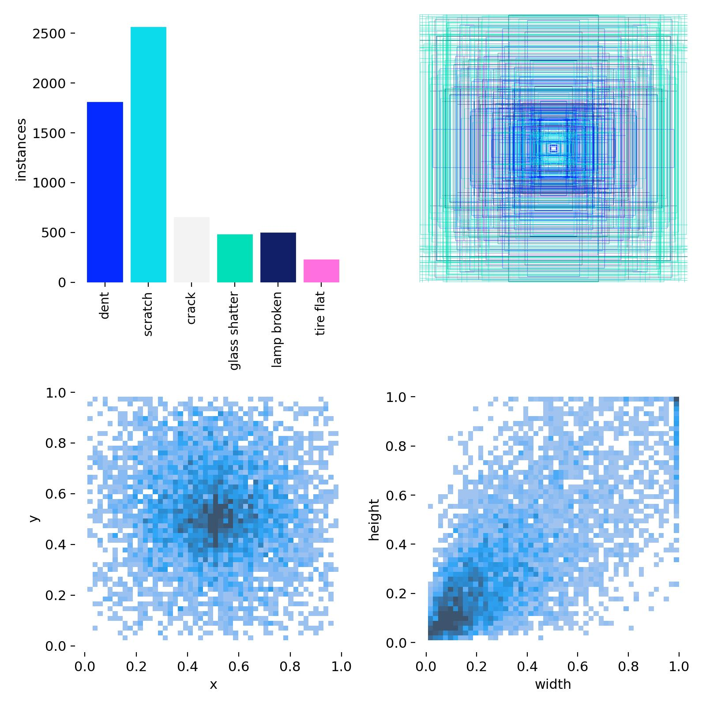
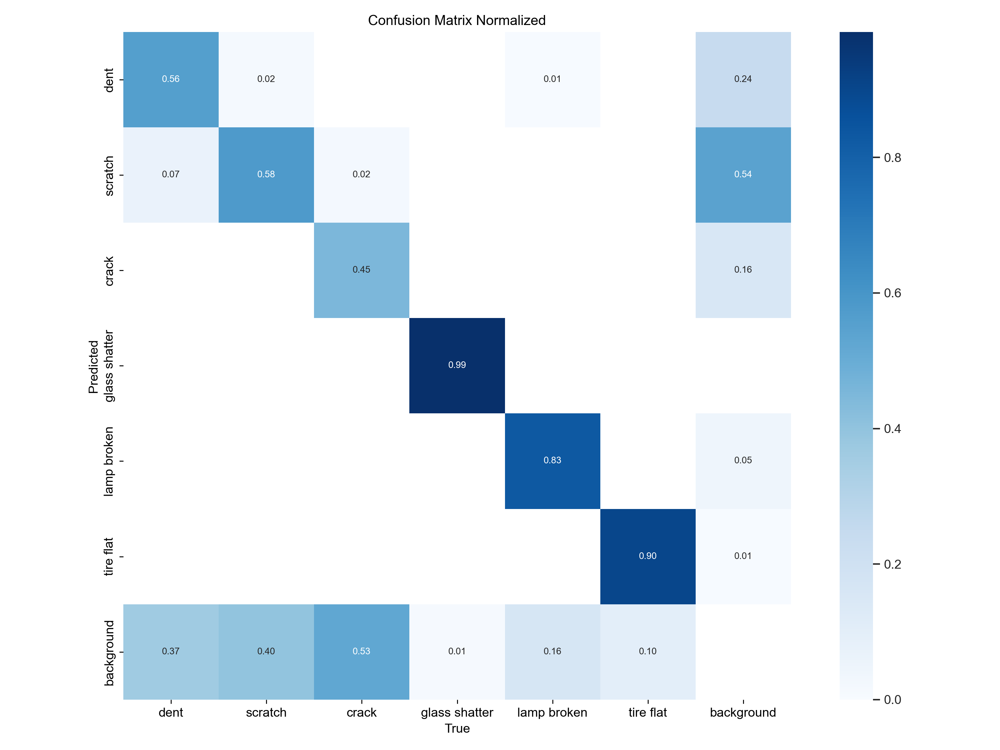
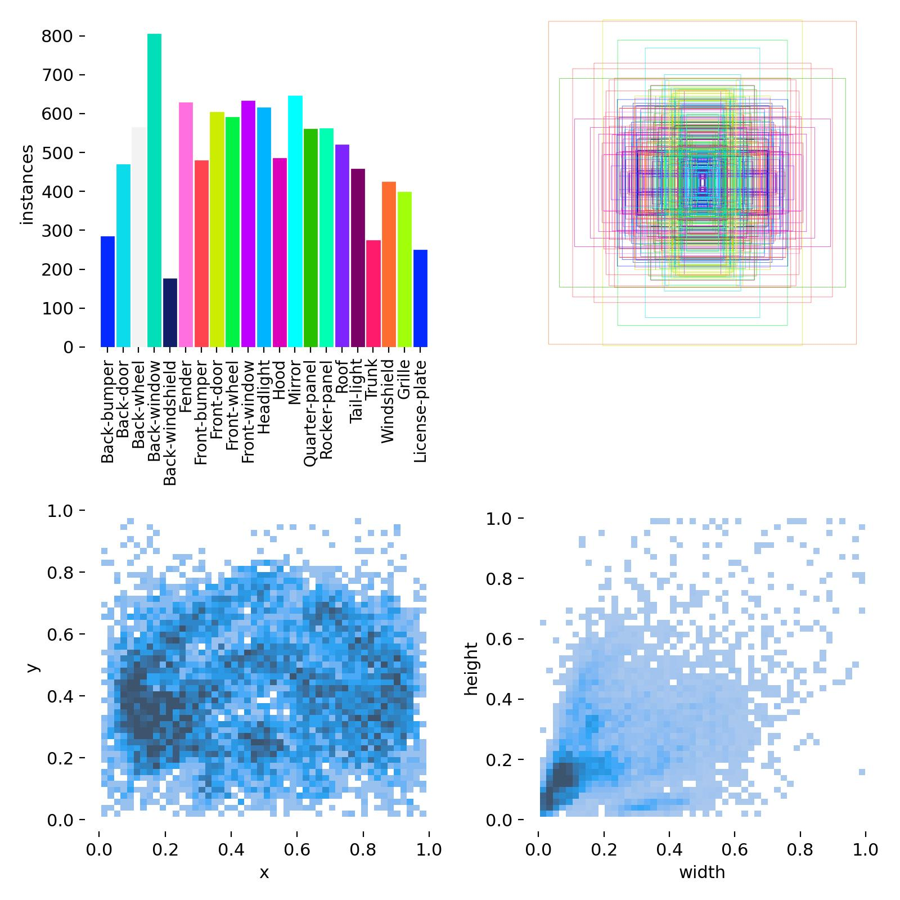
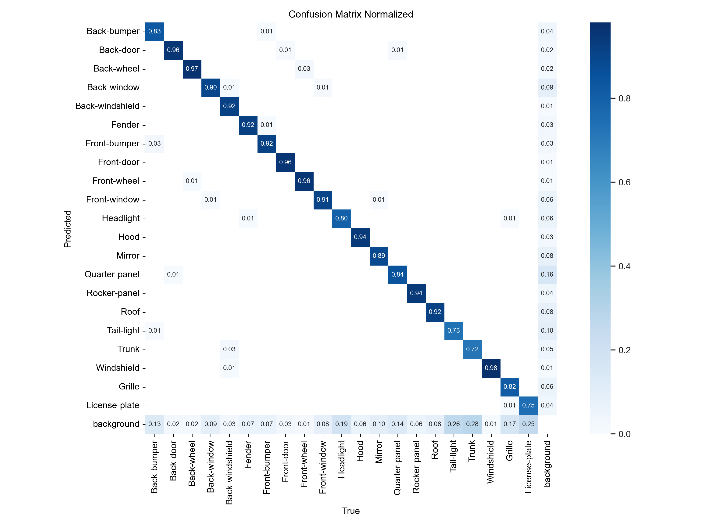
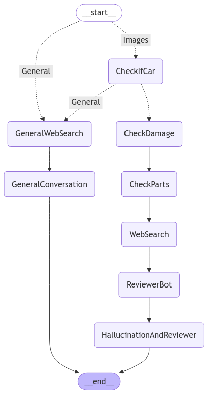
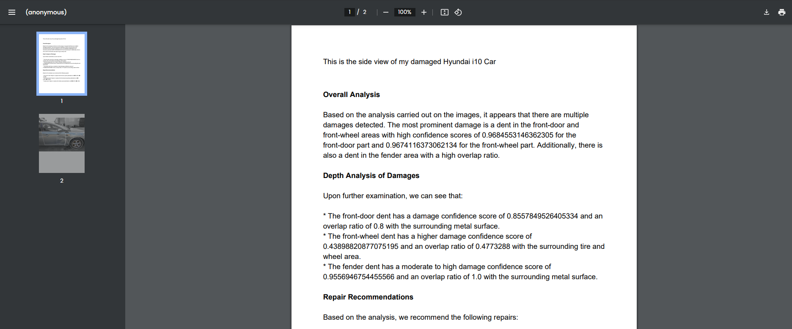

# 🚗 AI-Powered Car Damage Analysis System

## Project Overview

This multi-agent AI system presents car damage assessment using computer vision and large language model to provide comprehensive damage analysis and repair cost estimation. This system allows users to upload images and text, presents a review of damage, and provides an approximate cost of repair over the damage detection mapped with car parts segmentations.

## 🌟 Key Features

- **Damage Detection**
  - Image detection model with 78% precision and 71% mAP50
  - Accurate identification of car damages

- **Car Part Segmentation**
  - Image segmentation model with 89% precision and 87% mAP50
  - Detailed mapping of damage locations to specific car parts

- **Multi-Agent Workflow**
  - Powered by Llama 3.2 3B model via Ollama
  - LLM agents using LangChain
  - multi-agent process orchestration with LangGraph

- **Interactive Web Interface**
  - Streamlit-based microservice
  - Seamless image and text input processing
  - Real-time damage analysis visualization

## 🛠 Technology Stack

- **Computer Vision**: YOLOv11, Pillow, OpenCV
- **LLM**: Llama 3.2 3B
- **Orchestration**: LangGraph
- **Web Framework**: Streamlit
- **Agent Framework**: LangChain

## 📂 Project Structure

```


car-damage-analysis/
│
├── Application.py            # Main Streamlit application entry point
├── Graph.py                  # LangGraph configuration and workflow
├── Utility.py               # Utility functions and helpers
├── config.yaml              # Configuration file (API keys, settings)
│
├── InsuranceAgent/          # Core agent implementation directory
│   ├── AgentNodesEdges.py    # Agent node definitions
│   ├── Edges.py              # Conditional edge logic
│   ├── Inference.py          # Computer Vision inference
│   ├── Nodes.py              # Tool nodes
│   └── Prompts.py            # System prompts
│
├── Weights/                 # Model weight files
│   └── (pre-trained model weights)
│── README.md
│── requirements.txt
│── TrainingNotebookVersion1.ipynb # Car damages detection
└── TrainingNotebookVersion2.ipynb # car parts segmentation

```

## 🚀 Quick Start

### Prerequisites

- Python 3.8+
- Ollama
- LangChain
- LangGraph
- Streamlit
- Ultralytics
- Required dependencies (see `requirements.txt`)

### Installation

1. Clone the repository
```bash
git clone https://github.com/VigneshArjunRaj/MultiAgentCarDamageAnalysis.git
```

2. Install dependencies
```bash
pip install -r requirements.txt
```

3. Set up Tavily API (Optional)
```bash
# Add your Tavily API key to config.yaml
tavily_api_key: YOUR_API_KEY
```

4. Run the application
```bash
streamlit run Application.py
```

## 🖼 Features Demonstration

### Computer Vision Results
#### Detailed damage detection visualization




#### Car part segmentation overlay




### Workflow Visualization
- Interactive graph showing multi-agent process flow
- Step-by-step analysis breakdown



### Outputs
.png>)
.png>)
.png>)


## 🙏 Acknowledgments

- YOLOv11
- Llama 3.2
- LangChain
- Streamlit
- Ollama

---

**Disclaimer**: This project is a proof of concept demonstrating multi-agent AI capabilities in automotive damage assessment.